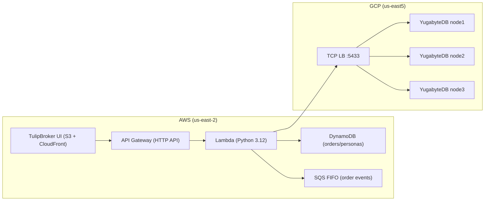

# 🌷 TulipBroker UI

**TulipBroker UI** is the front-end of the TulipBroker system — a simulated stock trading and resiliency-testing environment.  
It’s a lightweight **React + Vite** web application designed for modern, low-latency deployment on **AWS S3 + CloudFront**.

---

## 🚀 Overview

| Component | Description |
|------------|-------------|
| **React + Vite** | Core frontend framework with fast build times. |
| **AWS S3** | Hosts static site assets. |
| **CloudFront** | Provides HTTPS, caching, and custom domain (e.g., `tulips-qa.guusbosman.com`). |
| **CloudFormation** | Infrastructure as Code template for repeatable deployments. |
| **GitHub Actions / Local CLI** | Can automate deployment to QA or production environments. |

---

## 📁 Directory Structure

```
tulipbroker-ui/
├─ public/                     # Static assets (seed avatars, favicon, etc.)
├─ src/
│  ├─ api/                     # REST clients (e.g., personas API)
│  ├─ components/              # Reusable UI components
│  ├─ hooks/                   # Custom React hooks
│  ├─ screens/                 # Top-level views (Orders, Settings, etc.)
│  ├─ PersonaContext.tsx       # Persona provider used across screens
│  ├─ App.tsx / main.tsx       # React + Vite entry points
│  └─ index.css & assets/      # Shared styles/assets
├─ scripts/
│  └─ deploy.sh                # Build + sync to S3 + CloudFront invalidation
├─ ui-foundation.yaml          # One-time foundation (S3 bucket, CloudFront, ACM)
├─ ui.yaml                     # Repeatable per-env runtime stack wiring
├─ package.json
├─ tsconfig.json
└─ README.md
```

---

## 🧩 Key Features

- **Broker Simulation UI** — visual mock trading interface for demo and testing.
- **Dynamic Config Fetch** — connects to backend `/api/config` to show region and version.
- **Auto Build + Deploy** — single-step AWS deployment via CloudFormation.
- **Environment-Aware** — easily deploy multiple environments (`qa`, `prod`, etc.).
- **Persona Management** — add/edit TulipBroker personas (names, bios, avatars) directly from the UI Settings screen.
- **Orders Backend Toggle** — switch the orders data source (DynamoDB vs Yugabyte) from the Admin settings panel.

---

## 🗺️ AWS + GCP Dependencies (Visual)



## ⚙️ Deployment Steps

### 1. Prerequisites

- AWS CLI configured with valid credentials (`aws configure sso` recommended)
- Node.js 18+ and npm
- CloudFormation templates (`ui-foundation.yaml`, `ui.yaml`) ready

### 2. Build the UI

```bash
npm install
npm run build
```

This creates the optimized production build under `dist/`.

### 3. Deploy via CloudFormation (IaC)

*Run once per account/region:* provision the foundation stack (S3 bucket + CloudFront + cert) using `ui-foundation.yaml`.

```bash
aws cloudformation deploy \
  --template-file ui-foundation.yaml \
  --stack-name tulipbroker-ui-foundation \
  --capabilities CAPABILITY_IAM
```

*Per environment:* deploy or update the runtime stack defined in `ui.yaml` to wire the asset bucket + distribution aliases.

```bash
aws cloudformation deploy \
  --template-file ui.yaml \
  --stack-name tulipbroker-ui-qa \
  --parameter-overrides AssetBucketName=<bucket> DistributionId=<dist-id>
```

### 4. Upload UI Assets

Use the helper script to build, sync to S3, and optionally invalidate CloudFront:

```bash
./scripts/deploy.sh \
  STACK_NAME=tulipbroker-ui-qa \
  ASSET_BUCKET=<bucket-from-foundation> \
  DISTRIBUTION_ID=<dist-id>
```

The script runs `npm run build`, stamps `VITE_UI_BUILD_TIME`, copies `dist/` to the bucket, and submits an invalidation when a distribution ID is supplied.

### 5. Test Access

Once DNS propagation finishes, open:

```
https://tulips-qa.guusbosman.com
```

---

## 🧠 Environment Variables

When building locally, the following environment variables can be set in a `.env` file:

| Variable | Example | Description |
|-----------|----------|-------------|
| `VITE_API_URL` | `https://abc123.execute-api.us-east-2.amazonaws.com` | Backend API base URL used by orders/config/personas hooks. |
| `VITE_UI_BUILD_TIME` | `2024-02-10T19:45:00Z` | UTC timestamp surfaced on the Settings screen (auto-set by `scripts/deploy.sh`). |
| `VITE_CLIENT_ID` | `demo-ui` | Client identifier included when submitting orders. |

Example `.env.qa` file:

```
VITE_API_URL=https://abc123.execute-api.us-east-2.amazonaws.com
VITE_CLIENT_ID=demo-ui
VITE_UI_BUILD_TIME=2024-02-10T19:45:00Z
```

---

## 🧩 Orders Backend Toggle

The Admin settings panel lets you switch which database powers the Orders screen and the market pulse chart.  
The selection is stored in `localStorage`, so it persists across refreshes and browser restarts.

## 👥 Persona & Avatar Management

The **Settings → Users** panel (TB-202) lets you create, edit, and delete personas consumed across the UI:

1. Open the Settings screen and scroll to the “Users” section.
2. Existing personas are listed with avatar, name, and bio. Use **Set active**, **Edit**, or **Remove** actions.
3. The form at the bottom creates new personas (or edits the selected one). Provide a display name, optional bio, and upload a PNG/JPEG (≤200 KB).
4. Avatars are resized client-side to 128×128 circular thumbnails before being sent to the backend.

### Generating avatars

- Use AI tools such as DALL·E or Midjourney with prompts like  
  _“Cartoon portrait of Carolus Clusius holding a tulip bulb, flat pastel background.”_
- Export from the tool as a square PNG, then upload through the UI (it will handle the crop to 128×128).
- Seed avatars live in `public/avatars/`. Locally uploaded avatars can be stored in `public/uploads/avatars/` (gitignored) or uploaded to the backend when hooked up to S3.

When the backend personas API is unavailable, the UI falls back to the baked-in seed personas, so the dropdown and order form continue to work.

---

## 🧹 Cleanup

To remove all QA infrastructure:

```bash
aws cloudformation delete-stack --stack-name tulipbroker-ui-qa
aws s3 rb s3://tulipbroker-ui-qa-assets --force
```

---

## 🔮 Future Roadmap

- [ ] Integrate backend trading simulation API
- [ ] Add mock portfolio view
- [ ] Add CI/CD GitHub Actions deployment pipeline
- [ ] Implement user authentication (Cognito)
- [ ] Enhance UI with Tailwind animations and theming

---

## 👨‍💻 Author

**Guus Bosman**  
Created as part of the **TulipBroker Project**  
Focus: Fast, visual, and cloud-native experimentation.

---

### License
MIT License © 2025 Guus Bosman
